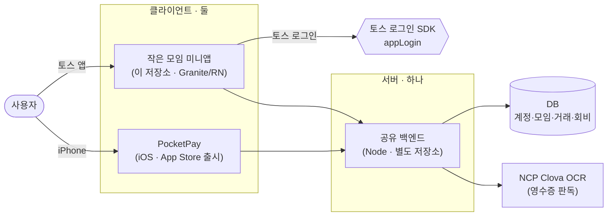

# 작은 모임 (PocketPay-Toss)

> 소모임 회비·정산·영수증을 자동으로 정리하는 **간편 가계부** — 앱인토스(Apps-in-Toss) 미니앱

[](https://minion.toss.im/zzIpbJMn)
[](https://minion.toss.im/zzIpbJMn)
동호회·여행·정기모임 같은 소규모 모임의 돈 관리를 간편하게 해주는 회계 앱이에요.
**영수증만 찍으면 거래가 자동 기록**되고, **1인당 얼마인지 자동 계산**해서 단톡방에 바로 공유할 수 있어요.
실제 송금은 하지 않고 "누가 얼마인지"를 자동으로 계산·기록·공유해, 모임 회계의 번거로움을 없애줍니다.

토스 앱 안에서 바로 실행되는 미니앱이며, iOS App Store에 정식 출시된 [PocketPay](https://github.com/P2P-J)를
앱인토스 플랫폼으로 포팅한 버전입니다. 백엔드는 기존 앱과 **동일한 서버를 공유**합니다.

## 시스템 구성

**클라이언트는 둘, 서버는 하나입니다.** 토스 미니앱(이 저장소)과 iOS 앱이 같은 백엔드·DB를 공유해요.
전체 동작 흐름은 [동작 흐름 로드맵 문서](docs/architecture.md)에서 확인할 수 있습니다.



---

## 주요 기능

| 기능 | 설명 |
|---|---|
| 🔐 **토스 로그인** | 별도 가입 없이 토스 계정으로 로그인 |
| 👥 **모임 만들기 / 참가** | 모임을 만들거나 초대 코드·QR로 참가 |
| 🧾 **영수증 OCR** | 영수증을 촬영하면 거래처·금액·날짜가 자동으로 채워져 기록 |
| 💰 **모임 가계부** | 이번 달 수입·지출·잔액을 홈에서 한눈에, 거래 검색·수정·삭제 |
| 📊 **지출 분석** | 카테고리별 지출·예산·월별 요약 확인 |
| 🤝 **멤버별 정산** | 1인당 부담액을 자동 계산해 '정산 리포트'를 단톡방에 공유 |
| 📅 **회비 관리** | 매달 누가 납부했는지 관리, 연결 계좌 등록 |

---

## 기술 스택

| 영역 | 사용 기술 |
|---|---|
| 프레임워크 | [Granite](https://tossmini-docs.toss.im) (React Native 0.84 · React 19) |
| 플랫폼 SDK | `@apps-in-toss/framework` |
| UI | [TDS](https://tossmini-docs.toss.im/tds-react-native) (`@toss/tds-react-native`) |
| 상태 관리 | [Zustand](https://github.com/pmndrs/zustand) |
| 라우팅 | `@granite-js/plugin-router` (파일 기반) |
| 언어 | TypeScript |
| 백엔드 | 공유 Node.js 서버 (별도 repo, 메인 PocketPay와 공유) |

---

## 프로젝트 구조

```
src/
├── pages/          # 파일 기반 라우팅 (화면 = 파일 하나)
│   ├── index.tsx        # 홈 (모임 가계부)
│   ├── login.tsx        # 토스 로그인
│   ├── transactions.tsx # 거래 내역
│   ├── analysis.tsx     # 지출 분석
│   ├── deal-new.tsx     # 거래 추가 (영수증 OCR)
│   ├── fees.tsx         # 회비 관리
│   └── ...
├── components/     # 화면별 UI 컴포넌트 (home / deal / analysis / more ...)
├── api/            # 백엔드 통신 (auth · team · deal · ocr · fee ...)
├── store/          # Zustand 스토어 (auth · team · budget ...)
├── lib/            # 유틸 (날짜 · 포맷 · 정산 계산 · 공유 · 검증)
├── hooks/          # 커스텀 훅
├── constants/      # 설정 · 상수
└── types/          # 타입 정의
```

라우팅은 **파일 기반**이라 `src/pages/analysis.tsx` 파일이 곧 `intoss://pocketpay/analysis` 화면이 됩니다.

---

## 시작하기

### 요구 사항
- Node.js 20+
- 앱인토스 개발 환경 (`ait` CLI) — [개발 가이드](https://tossmini-docs.toss.im)

### 설치 & 실행
```bash
# 의존성 설치
npm install

# 로컬 개발 서버 (토스 개발자 앱에서 QR로 연결)
npm run dev

# 타입 체크 / 린트 / 테스트
npm run typecheck
npm run lint
npm run test

# 빌드 & 배포
npm run build
npm run deploy   # ait deploy
```

---

## 브랜드

| 용도 | 컬러 |
|---|---|
| 메인 (그린) | `#3DD598` |
| 수입 (블루) | `#3182F6` |
| 지출 (레드) | `#F04452` |

- **앱 이름**: 작은 모임 · **appName**: `pocketpay`
- **스킴**: `intoss://pocketpay`
- **앱 유형**: 비게임 (TDS 사용)

---

## 라이선스 & 문의

- 고객센터: pocketpay2026@gmail.com
- 본 저장소는 비공개 프로젝트입니다.
