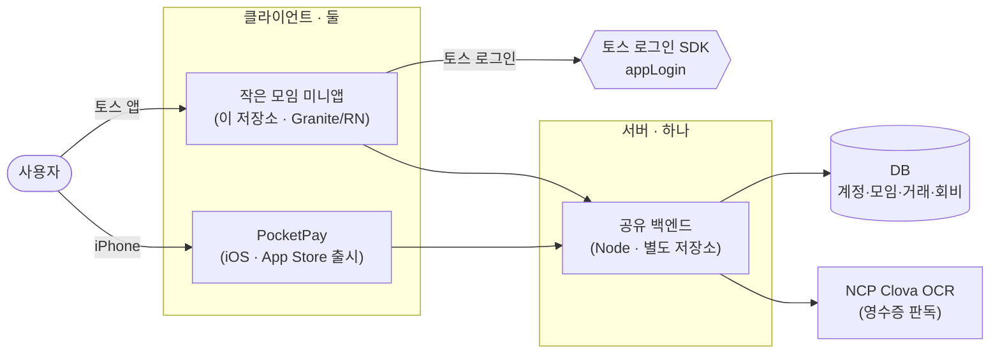
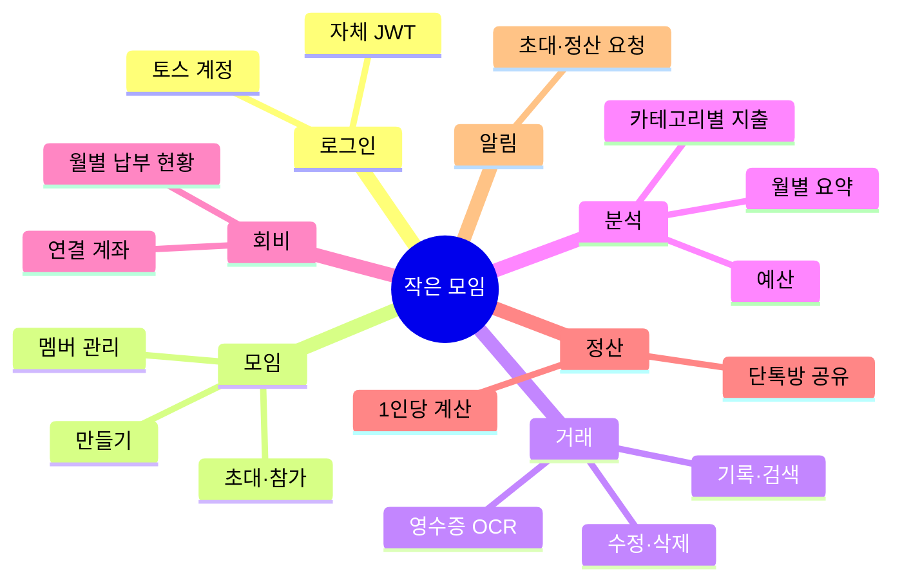
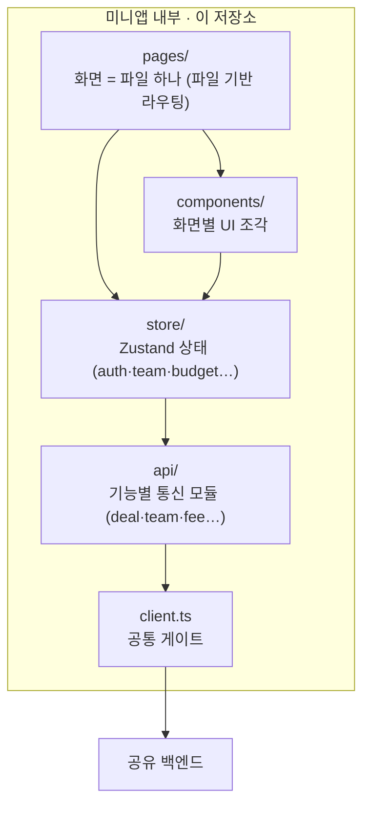
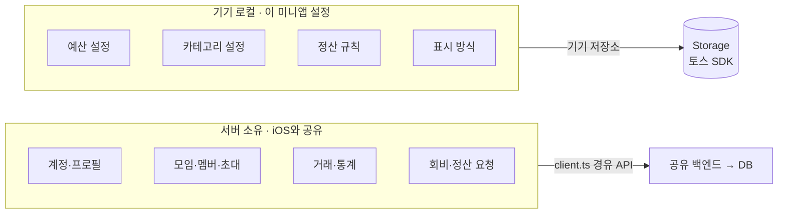
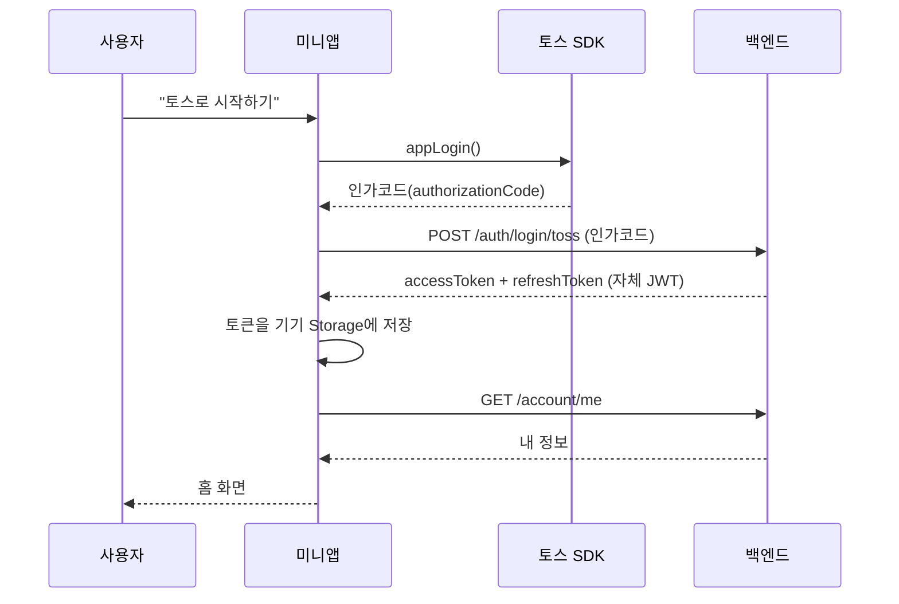
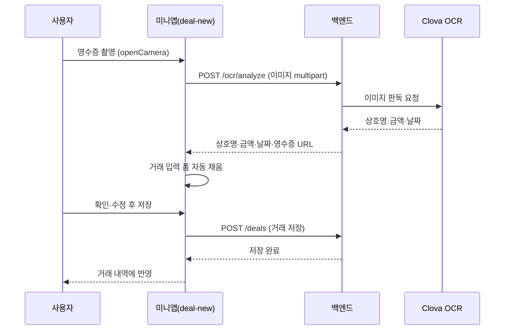
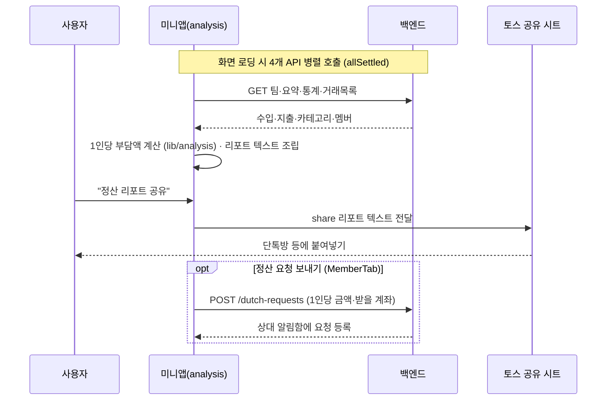

# 작은 모임 — 동작 흐름 로드맵

> 이 문서는 **처음 보는 사람이 이 프로젝트가 어떻게 동작하는지** 위에서 아래로 읽으며 이해하도록 만들었어요.
> 큰 그림 → 기능 → 프론트엔드 → 데이터 → 핵심 흐름 → 기술 선택 순서로 좁혀집니다.
> 모든 그림은 [Mermaid](https://mermaid.js.org)라 GitHub에서 자동으로 렌더링됩니다.

---

## 1. 한눈에 — 시스템 구성

**클라이언트는 둘, 서버는 하나입니다.** 토스 미니앱(이 저장소)과 iOS 앱(PocketPay)이
**같은 백엔드·같은 DB**를 공유합니다. 그래서 iOS에서 기록한 거래를 토스 미니앱에서 그대로 볼 수 있어요.

- **미니앱(이 저장소)** — 토스 앱 안에서 실행되는 React Native 미니앱. 토스 계정으로 로그인합니다.
- **PocketPay(iOS)** — 먼저 출시된 네이티브 앱. 이 미니앱은 그 포팅 버전입니다.
- **공유 백엔드** — 두 클라이언트가 함께 쓰는 Node 서버. 실제 데이터와 OCR 중계를 담당합니다.

---

## 2. 기능 지도 — 무엇을 할 수 있나

로그인부터 정산까지 7개 기능 묶음으로 이뤄집니다. 각 기능이 **어떤 화면**이고 **어떤 백엔드 API**를 쓰는지 아래 표로 정리했어요.

| 기능 | 화면 | 대표 백엔드 API |
|---|---|---|
| **로그인** | `/login` | `POST /auth/login/toss`, `GET /account/me` |
| **모임** | `/team-new` · `/members` | `POST /teams`, `GET /teams`, `POST /teams/{id}/invite-token`, `POST /invitations/{id}/accept` |
| **거래** | `/deal-new` · `/transactions` | `POST /ocr/analyze`, `POST /deals`, `GET /deals?teamId=…` |
| **분석** | `/analysis` | `GET /deals/stats/{teamId}`, `GET /deals/summary/{teamId}` |
| **회비** | `/fees` | `GET /fees/{teamId}`, `POST /fees/{teamId}` |
| **정산** | `/analysis`(공유) · `/alerts` | `POST /dutch-requests`, `GET /dutch-requests` |
| **알림** | `/notifications` | `GET /account/notifications-unread-count` |

---

## 3. 프론트엔드는 어떻게 동작하나 — 4개 레이어

미니앱 내부는 **화면 → UI → 상태 → 통신**의 4개 레이어로 나뉩니다.
모든 데이터 요청은 마지막에 `client.ts` **하나의 문**을 통과합니다.

이 저장소만의 설계 포인트 두 가지:

- **`client.ts` 단일 게이트** — 모든 요청이 여기 한 곳을 지납니다. 그래서 이 파일 하나가
  ① `Authorization: Bearer` 토큰 자동 첨부, ② 응답이 **401이면 refresh 토큰으로 갱신 후 자동 재시도**,
  ③ 네트워크 타임아웃 공통 처리를 담당합니다. 각 기능 모듈은 인증·재시도를 신경 쓰지 않아요.
- **모임별 상태 분리(team-scoped store)** — 예산·계좌·정산규칙처럼 모임마다 달라지는 값은
  `createTeamScopedStore` 팩토리로 `teamId`별로 따로 보관합니다. 모임을 전환해도 값이 섞이지 않습니다.

---

## 4. 데이터는 누가 소유하나 — 서버 vs 기기

모든 데이터가 서버에 있는 건 아닙니다. **iOS와 공유해야 하는 진짜 데이터**는 서버가,
**이 미니앱의 개인 표시 설정**은 기기가 소유합니다. 이게 백엔드를 공유할 수 있는 이유예요.

- **서버 소유** — 로그인하면 어느 기기에서도 동일하게 보이고, iOS 앱과도 공유됩니다.
- **기기 로컬** — 예산·카테고리 같은 개인 취향 설정. 서버 왕복 없이 즉시 반영되고, 이 미니앱 안에서만 유지됩니다.

---

## 5. 핵심 흐름 3종 — 실제로 어떤 순서로 도나

### 5-1. 로그인 — 토스 계정을 자체 JWT로 교환

토스가 넘겨주는 건 **인가코드**까지입니다. 그걸 백엔드가 **iOS와 동일한 JWT 체계**로 바꿔주기 때문에
두 클라이언트가 같은 서버를 쓸 수 있어요.

### 5-2. 영수증 OCR → 거래 자동 기록 (대표 기능)

이 앱의 핵심 가치인 **"영수증만 찍으면 끝"**이 코드상 어디서 일어나는지 보여줍니다.
판독은 서버가 Clova OCR로 대신 하고, 프론트는 그 결과로 **입력 폼을 자동으로 채웁니다.**

### 5-3. 정산 리포트 → 단톡방 공유

실제 송금은 하지 않습니다. 서버는 **요약·통계 데이터만** 주고, **1인당 부담액은 클라이언트가 계산**합니다.
(`src/lib/analysis.ts`에서 `지출 ÷ 멤버 수`) 그 결과를 텍스트로 조립해 단톡방 등에 공유해요.
토스 공유는 텍스트만 지원하므로 리포트를 문자열로 만듭니다.

---

## 6. 기술 스택 — 무엇을 왜 골랐나

| 영역 | 선택 | 이유 |
|---|---|---|
| 프레임워크 | **Granite** (React Native 0.84 · React 19) | 토스 앱 안에서 네이티브 성능으로 동작. 앱인토스 공식 프레임워크. |
| UI | **TDS** (`@toss/tds-react-native`) | 토스 디자인 시스템. 비게임 미니앱 심사 필수이자 일관된 UX. |
| 상태 관리 | **Zustand** | 보일러플레이트 없이 가벼움. 모임별 상태 분리 팩토리를 얹기 좋음. |
| 라우팅 | **파일 기반** (`@granite-js/plugin-router`) | `pages/파일 = 화면 하나`. 화면 구조가 폴더에 그대로 드러남. |
| 언어 | **TypeScript** | API 응답 타입을 고정해 프론트-백엔드 계약을 코드로 검증. |
| 백엔드 | **공유 Node 서버** (별도 저장소) | iOS 앱과 동일 서버·DB. 데이터·OCR 중계를 한 곳에서. |

---

> **요약** — 토스 미니앱과 iOS 앱이 하나의 백엔드를 공유하고, 미니앱 내부는 4개 레이어로 나뉘며
> 모든 요청은 `client.ts` 한 문을 지납니다. 대표 흐름은 *로그인 → 영수증 OCR 자동기록 → 정산 공유*입니다.
